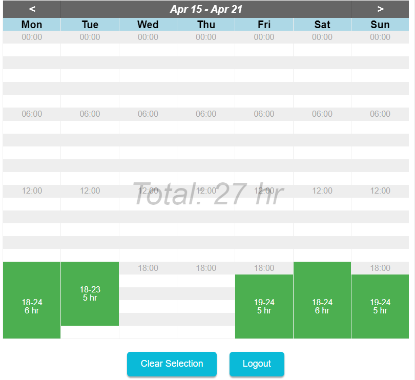

# View Roster

Welcome to the View Roster project! This project aims to provide a simple and efficient way to record, view and manage roster entries. User can sign up/in and easily add, edit, and clear hour blocks for each roster entry, in a week view layout.
> URL: [https://view-roster.web.app/](https://view-roster.web.app/)

## Features

- Record and view current, past, and future roster entries
- Add, edd and clear hour blocks for each roster entry
- Sign up/in to access and manage roster entries
- Get total hours worked in each week to help with payroll, time management, and work restrictions

## Dependencies
The View Roster project requires the following dependencies:
- Frontend: HTML, CSS, JavaScript, React.js
- Backend: Node.js, Google Cloud Platform: Firebase
- Database: Firestore (NoSQL)
- Authentication: Firebase Authentication
- Hosting: Firebase Hosting
- Version Control with CI/CD: GitHub, GitHub Actions

## Getting Started

To get started with the View Roster project, follow these steps:

1. Clone the repository to your local machine.
2. Install the necessary dependencies: `node.js`, `npm`, `firebase-tools`
3. Get `firebase-config.js` after setting up a Firebase project and add it to the `src` folder.
> Note: The `firebase-config.js` file should contain the Firebase configuration object, for example:
```javascript
export const firebaseConfig = {
    apiKey = <API_KEY>,
    ...
};
```
4. Run the application using the following command: `npm start`

## Usage

Once the application is up and running, you can access the roster view by navigating to the provided url. From there, you can perform various actions such as viewing, adding, and clearing roster entries.

## Contributing

Contributions are welcome! If you would like to contribute to the View Roster project, please follow these guidelines:

1. Fork the repository.
2. Create a new branch for your feature or bug fix.
3. Make your changes and commit them.
4. Push your changes to your forked repository.
5. Submit a pull request.

## License

This project is licensed under the GNU General Public License v3.0. For more information, see the `LICENSE` file.

## Contact
Email: manoj.shrestha8080@gmail.com

## Screenshot
